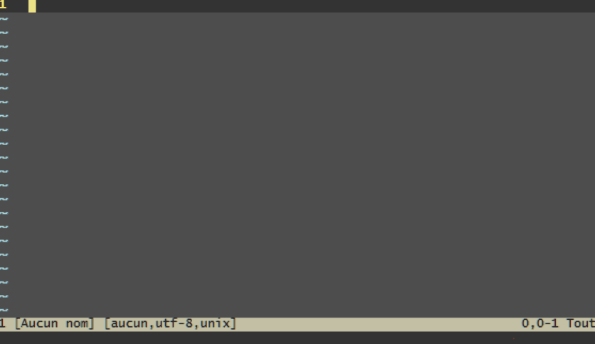

# Gtd.vim

Gtd.vim is a Vim plugin to deal with your tasks in a GTD way. It helps you
manage them in separate files and retrieve archived files with tags.

## Installation

Make sure `filetype plugin on` (or something similar) is included in your vimrc
to enable plugins.

The following methods allude to your personal Vim directory `~/.vim`. If you
don't use GNU/Linux, you may have to replace this with your runtime path. See
`:h 'runtimepath'`.

Depending on the method you prefer to install plugins, you might choose:

### Traditional

If you want to install Gtd.vim plugin the traditional way, simply download the
archive from Github and extract it to your personal Vim directory.

### Package

	$ mkdir -p ~/.vim/pack/plugins/start
	$ cd ~/.vim/pack/plugins/start/
	$ git clone https://github.com/phb1/gtd.vim

Notes:
- Replace the subdirectory "plugins" with whatever you like.
- You can replace the subdirectory "start" with "opt" if you prefer loading
  yourself the plugin with `:packadd` command.
- See `:h package`

### Vundle

	Plugin 'phb1/gtd.vim'

### Pathogen

	$ cd ~/.vim/bundle
	$ git clone https://github.com/phb1/gtd.vim

## Basic configuration

	:filetype plugin on
	:let g:gtd#dir = '~/notes'

## Read the documentation

	:helptags ALL
	:h gtd.vim
